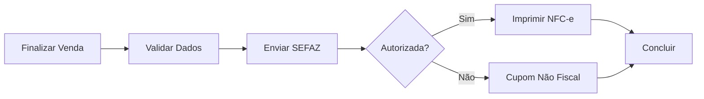

# 🖨️ PDV - Emissão de NFC-e

## 📋 Fluxo Completo

### 1. Venda no PDV
```
Cliente → Adicionar Produtos → Finalizar Venda → Escolher Pagamento → Emitir NFC-e
```

### 2. Processo Automático



## 🚀 Uso no PDV

### Endpoint API

```http
POST /api/vendas/{vendaId}/finalizar
Content-Type: application/json

{
  "empresaId": "3fa85f64-5717-4562-b3fc-2c963f66afa6",
  "formaPagamento": "PIX",
  "emitirNFCe": true
}
```

### Resposta Sucesso

```json
{
  "sucesso": true,
  "vendaFinalizada": true,
  "vendaId": "3fa85f64-5717-4562-b3fc-2c963f66afa6",
  "chaveNFCe": "35250112345678000190650010000000011234567890",
  "xmlNFCe": "<?xml version=\"1.0\"...",
  "valorTotal": 150.00
}
```

### Resposta Erro

```json
{
  "sucesso": false,
  "vendaFinalizada": true,
  "erro": "Venda finalizada mas NFC-e falhou: Certificado expirado"
}
```

## 💻 Implementação no PDV

### Service (C#)

```csharp
var resultado = await VendaService.FinalizarVendaAsync(
    vendaId: vendaId,
    formaPagamento: "PIX",
    emitirNFCe: true
);

if (resultado.Sucesso)
{
    await ImprimirNFCe(resultado.ChaveNFCe, resultado.XmlNFCe);
    MostrarMensagem("Venda finalizada com sucesso!");
}
```

### Blazor Component

```razor
<button @onclick="FinalizarVenda">
    ✅ Finalizar e Emitir NFC-e
</button>

@code {
    private async Task FinalizarVenda()
    {
        var resultado = await VendaService.FinalizarVendaAsync(
            VendaId, formaPagamento, emitirNFCe: true
        );
        
        if (resultado.Sucesso)
        {
            await ImprimirNFCe(resultado.ChaveNFCe);
        }
    }
}
```

## 🖨️ Impressão NFC-e

### Impressora Térmica (ESC/POS)

```csharp
public async Task ImprimirNFCeAsync(string chaveAcesso, string xmlNFCe)
{
    // Comandos ESC/POS
    var comandos = new StringBuilder();
    comandos.Append("\x1B\x40"); // Inicializar
    comandos.Append("\x1B\x61\x01"); // Centralizar
    comandos.Append("NFC-e\n");
    comandos.Append($"Chave: {chaveAcesso}\n");
    
    // QR Code
    comandos.Append(GerarQRCodeESCPOS(chaveAcesso));
    
    // Cortar papel
    comandos.Append("\x1D\x56\x00");
    
    await EnviarParaImpressora(comandos.ToString());
}
```

### Impressoras Suportadas

- **Bematech MP-4200 TH**
- **Elgin i9**
- **Epson TM-T20**
- **Daruma DR-800**
- **Qualquer ESC/POS**

### Conexões

```csharp
// Serial (COM)
var impressora = new SerialPort("COM1", 9600);

// USB
var impressora = new USBPrinter(vendorId: 0x0416, productId: 0x5011);

// Rede
var impressora = new NetworkPrinter("192.168.1.100", 9100);
```

## ⚙️ Configuração Empresa

### Dados Necessários

```json
{
  "cnpj": "12345678000190",
  "razaoSocial": "EMPRESA LTDA",
  "nomeFantasia": "LOJA",
  "logradouro": "RUA EXEMPLO",
  "numero": "123",
  "bairro": "CENTRO",
  "cidade": "SAO PAULO",
  "uf": "SP",
  "cep": "01234567",
  "certificadoDigital": "base64_do_pfx",
  "senhaCertificado": "senha123",
  "ambienteHomologacao": false
}
```

## 🔄 Modo Offline

### Contingência

Quando SEFAZ está offline:

1. **Cupom Não Fiscal** - Imprimir cupom sem valor fiscal
2. **Fila de Emissão** - Guardar venda para emitir depois
3. **Sincronização** - Emitir NFC-e quando SEFAZ voltar

```csharp
if (!sefazOnline)
{
    await ImprimirCupomNaoFiscal(venda);
    await FilaEmissao.AdicionarAsync(venda);
}
```

## 📊 Numeração NFC-e

### Sequencial por Empresa

```sql
SELECT MAX(CAST(numero AS INTEGER)) + 1 
FROM nfce 
WHERE empresa_id = @empresaId 
  AND serie = '1'
```

### Controle de Série

- **Série 1** - PDV Principal
- **Série 2** - PDV Secundário
- **Série 3** - Delivery

## ⚠️ Tratamento de Erros

### Erros Comuns

| Código | Descrição | Solução |
|--------|-----------|---------|
| 539 | Certificado expirado | Renovar certificado |
| 204 | Duplicidade de NF-e | Verificar numeração |
| 108 | Serviço paralisado | Aguardar SEFAZ |
| 999 | Erro de comunicação | Verificar internet |

### Retry Automático

```csharp
var policy = Policy
    .Handle<HttpRequestException>()
    .WaitAndRetryAsync(3, retryAttempt => 
        TimeSpan.FromSeconds(Math.Pow(2, retryAttempt))
    );

await policy.ExecuteAsync(async () => 
{
    await _nfeService.EmitirNFeAsync(request);
});
```

## 🧪 Testes

### Ambiente Homologação

```json
{
  "NFe": {
    "Homologacao": true,
    "CertificadoPath": "certificado_teste.pfx"
  }
}
```

### Dados de Teste

- **CNPJ**: 99.999.999/0001-91
- **CPF**: 123.456.789-09
- **Produtos**: Usar NCM válido

## 📱 Interface PDV

### Tela Finalizar Venda

```
┌─────────────────────────────────┐
│     FINALIZAR VENDA             │
├─────────────────────────────────┤
│ Valor Total: R$ 150,00          │
│                                 │
│ Forma de Pagamento:             │
│ ○ Dinheiro                      │
│ ● PIX                           │
│ ○ Débito                        │
│ ○ Crédito                       │
│                                 │
│ ☑ Emitir NFC-e                  │
│                                 │
│ [  FINALIZAR VENDA  ]           │
└─────────────────────────────────┘
```

### Feedback Visual

```
✅ Venda Finalizada!
📄 NFC-e: 3525...7890
🖨️ Imprimindo cupom...
```

## 🔐 Segurança

### Certificado Digital

- Armazenar criptografado
- Nunca expor senha
- Renovar antes do vencimento

### Logs

```csharp
_logger.LogInformation(
    "NFC-e emitida: {ChaveAcesso} - Venda: {VendaId}",
    chaveAcesso, vendaId
);
```

## 📞 Suporte

### Problemas Comuns

1. **NFC-e não autoriza** - Verificar certificado e dados
2. **Impressora não imprime** - Testar conexão
3. **SEFAZ offline** - Usar contingência

### Contato SEFAZ SP

- Portal: https://www.fazenda.sp.gov.br/nfce
- Telefone: 0800-170-110
